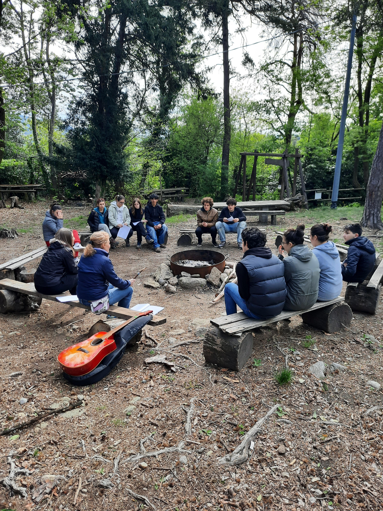

## 1 - 4 Maggio 2025 Curino (BI)
## Identità

<figure>
       
</figure>

## TEMATICA

L’**identità** è una tematica fondamentale per i preadolescenti e gli adolescenti. 
Attraverso un’avventura scritta appositamente sul tema dell’identità e giochi in 
scatola selezionati il gruppo avrà diversi spunti su cui riflettere: quali sono 
i nostri talenti? Come vogliamo usarli nella nostra vita? Come ci influenzano 
le nostre origini? Cosa ci distingue e cosa ci unisce agli altri?

## ATTIVITÀ

- Avventura di gioco di ruolo 
- Cerchi di parola
- Giochi in scatola
- Giochi a squadre
- Canzoni
- Passeggiate nella natura

## LA CASA

<figure>
       
</figure>

La casa che ci ospiterà si trova nella frazione di San Nicolao, a Curino ed 
è una struttura di due piani con giardino. 
Contiene due camerate, bagni in comune, un salone per i pasti e le attività. 
Sull’esterno troviamo un bellissimo porticato che si affaccia sull’area verde
 dove sarà possibile – clima permettendo – svolgere attività di movimento e falò.

 ## TESTIMONIANZE DI ALTRI TURNI

 INSERIRE IL VIDEO

 ## Programma sommativo delle giornate

**1 MAGGIO** 

- Accoglienza alle 14:00
- Giochi di presentazione
- Sessione di costruzione dei personaggi per il gioco di ruolo
- Sessione serale di gioco di ruolo
- Cerchio di parola

**2 MAGGIO**

- Dinamiche rompighiaccio e Cerchio mattutino
- Passeggiata in natura
- Gioco da tavolo sulla tematica e riflessione
- Sessione di gioco di ruolo
- Serata di giochi a squadre
- Cerchio serale

**3 MAGGIO** 

- Dinamiche rompighiaccio e Cerchio mattutino
- Attività sulla tematica
- Gioco da tavolo sulla tematica e riflessione
- Sessione di gioco di ruolo
- Serata di festa (giochi vari, balli, karaoke, attività proposte dal gruppo)

**4 MAGGIO**

- Dinamiche rompighiaccio
- Cerchio di parola sull’avventura giocata
- Cerchio di parola sull’esperienza vissuta
- Sistemazione della casa e bagagli
- Saluti alle 16

## PRE-ISCRIZIONE

Se siete interessati a iscrivervi a questo Turno di Guardia potete compilare
il seguente form per dichiarare il vostro interesse. Vi arriverà una mail
entro qualche giorno con le indicazioni per confermare la prenotazione. 

**Ricordiamo che questo Turno è riservato a ragazzi dai 14 ai 19 anni**

INSERIRE IL FORM
