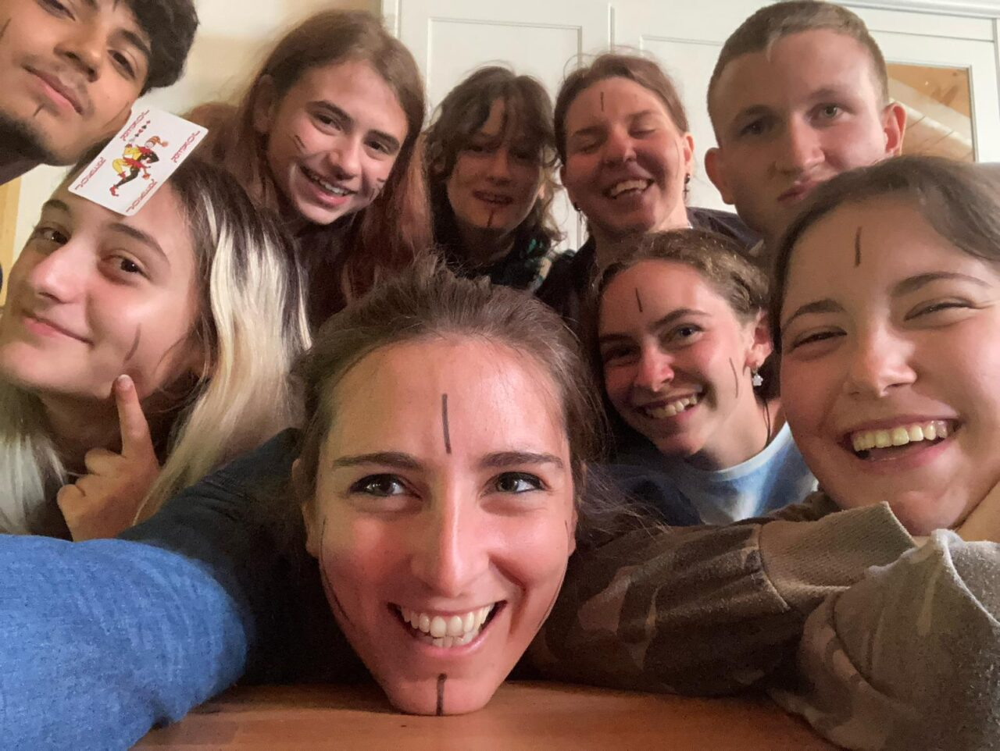
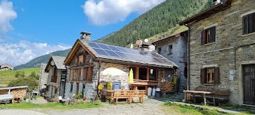

## 31 Agosto - 6 Settembre 2025 Tartano (SO)
## Cambiamento
<figure>
      
</figure>

## TEMATICA

Il **cambiamento** è una tematica fondamentale per gli adolescenti. 
Attraverso un’avventura scritta appositamente su questo tema e giochi in scatola selezionati il gruppo avrà diversi spunti su cui riflettere: come affronto le fasi di cambiamento e passaggio nella mia vita? Cosa prevale: senso di smarrimento o senso di libertà? Quali paure emergono da una situazione che cambia e come le gestisco?

## ATTIVITÀ

- Avventura di gioco di ruolo 
- Cerchi di parola
- Giochi in scatola
- Giochi a squadre
- Canzoni
- Passeggiate nella natura

## IL RIFUGIO

<figure>
      
</figure>

Il rifugio che ci ospiterà si trova nel borgo di Arale, in Val Tartano (SO) ed è una struttura che si sviluppa su due diversi edifici. Una casa ospita la camerata su due piani, completa di bagni e docce separate. L’altro edificio ospita la sala in cui si svolgono i pasti e le attività al tavolo, mentre al piano di sotto troviamo un altro spazio per le attività al chiuso e un bagno completo di doccia.  Lo spazio all’aperto è molto ampio e non ha un confine con le montagne e i boschi circostanti, il che ci permetterà – clima permettendo – di effettuare brevi passeggiate e vere e proprie escursioni. Il rifugio è gestito dal Pirata Vittorio e da Leila, che si occupano della preparazione dei pasti. 

 ## TESTIMONIANZE DI ALTRI TURNI

 INSERIRE IL VIDEO

 ## Programma sommativo delle giornate

**31 AGOSTO**

- Accoglienza alle 14:00
- Sistemazione nelle camerate e giochi di presentazione
- Attività sulla tematica e riflessioni guidate
- Sessione di costruzione dei personaggi per il gioco di ruolo
- Cerchio di parola

**1 SETTEMBRE**

- Dinamiche rompighiaccio e Cerchio mattutino
- Giochi a squadre e di movimento
- Sessione di gioco di ruolo
- Giochi a squadre
- Cerchio serale

**2 SETTEMBRE**

- Dinamiche rompighiaccio e Cerchio mattutino
- Passeggiata in natura e pranzo al sacco
- Attività sulla tematica e rientro al rifugio
- Sessione di gioco di ruolo
- Cerchio serale

**3 SETTEMBRE**

- Dinamiche rompighiaccio e Cerchio mattutino
- Giochi in scatola sulla tematica e riflessioni guidate
- Sessione di gioco di ruolo
- Giochi a squadre
- Cerchio serale

**4 SETTEMBRE**

- Dinamiche rompighiaccio e Cerchio mattutino
- Sessione di gioco di ruolo
- Passeggiata in natura e merenda al sacco
- Giochi a squadre
- Cerchio serale

**5 SETTEMBRE**

- Dinamiche rompighiaccio e Cerchio mattutino
- Giochi in scatola sulla tematica e riflessioni guidate
- Sessione di gioco di ruolo
- Serata di festa (giochi vari, balli, karaoke, attività proposte dal gruppo)

**6 SETTEMBRE**

- Dinamiche rompighiaccio
- Debriefing sull’avventura e la tematica
- Sistemazione della casa e bagagli
- Momento di saluti
- Partenza alle 16

## PRE-ISCRIZIONE

Se siete interessati a iscrivervi a questo Turno di Guardia potete compilare
il seguente form per dichiarare il vostro interesse. Vi arriverà una mail
entro qualche giorno con le indicazioni per confermare la prenotazione. 

**Ricordiamo che questo Turno è riservato a ragazzi dai 14 ai 19 anni**

INSERIRE IL FORM
