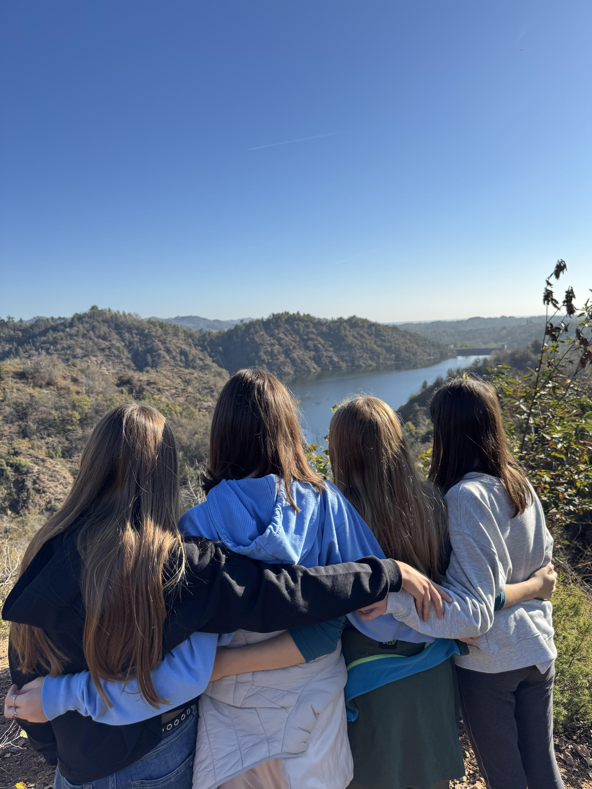

## 6 - 8 DICEMBRE 2025 CURINO (BI)

## Cambiamento
<figure>
      
</figure>

## TEMATICA

Il **cambiamento** è una tematica fondamentale per i preadolescenti.
Attraverso un’avventura scritta appositamente su questo tema e giochi in scatola selezionati, il gruppo avrà diversi spunti su cui riflettere: come affronto le fasi di cambiamento e passaggio nella mia vita? Cosa prevale: senso di smarrimento o senso di libertà? Quali paure emergono da una situazione che cambia e come le gestisco?

## ATTIVITÀ

- Avventura di gioco di ruolo
- Cerchi di parola
- Giochi in scatola
- Giochi a squadre
- Canzoni
- Passeggiate nella natura

## LA CASA

<figure>
      
</figure>

La casa che ci ospiterà si trova nella frazione di San Nicolao, a Curino, in provincia di Biella. È una struttura con cui collaboriamo volentieri da tempo perché amiamo la loro ospitalità e perché il ricavato di ciò che viene dato loro per l'alloggio viene versato all'Organizzazione Mato Grosso. La casa si sviluppa su due piani e ha un ampio giardino all'esterno, completo di calcetto e ping pong. Il piano terra viene utilizzato per le attività principali e i pasti, sono presenti due bagni sotto al porticato. Il primo piano ospita invece la camera delle formatrici, una delle due camerate e altri bagni. Mentre la soffitta ospita l'ultima camerata disponibile. Durante il nostro soggiorno è possibile che familiari e amici della signora Antonia, che ci ospita e si prende cura di noi, arrivino alla casa, ma sempre lasciandoci spazio e riservatezza per effettuare le nostre attività nei luoghi prestabiliti.

 ## TESTIMONIANZE DI ALTRI TURNI



 ## Programma sommativo delle giornate




Accoglienza alle 10:00 
Sistemazione nelle camerate e giochi di presentazione 
Primo Cerchio per la condivisione degli Accordi e dei Turni di servizio 
Sessione di costruzione dei personaggi per il gioco di ruolo 
Sessione di gioco di ruolo 
Giochi a squadre 
Cerchio di parola



Dinamiche rompighiaccio e Cerchio mattutino 
Passeggiata in natura e attività sul tema 
Gioco in scatola sul tema 
Sessione di gioco di ruolo 
Serata di festa con proposte dei ragazzi 
Cerchio serale



Dinamiche rompighiaccio e Cerchio mattutino 
Sessione di gioco di ruolo 
Cerchio serale



Dinamiche rompighiaccio e Cerchio mattutino 
Giochi in scatola sulla tematica e riflessioni guidate 
Sessione di gioco di ruolo 
Sistemazione della casa e bagagli  
Debriefing sull’avventura e la tematica  
Momento di saluti  
Partenza alle 17:30




## PREZZO
I prezzi sono in via di definizione. Verranno aggiornati a settembre con l'apertura delle iscrizioni.

## PRE-ISCRIZIONE
Se siete interessati a iscrivervi a questo Turno di Guardia tenete d'occhio il sito: a settembre aprono le iscrizioni e solitamente i posti si esauriscono in fretta!

**Ricordiamo che questo Turno è riservato a ragazzi delle medie dagli 11 ai 14 anni**
