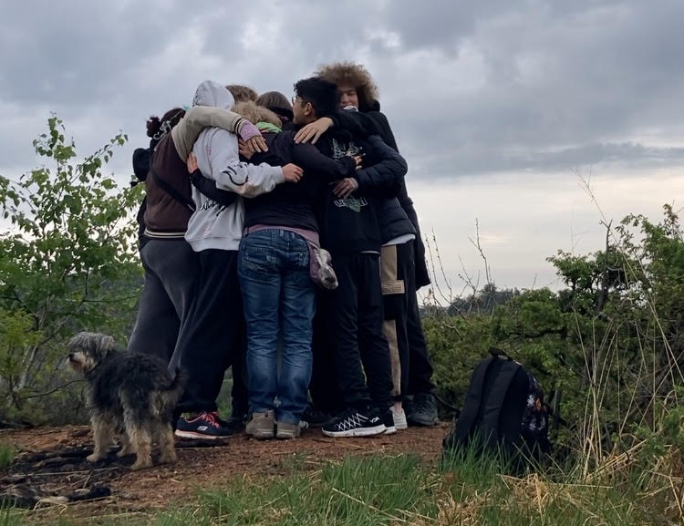

## 2 - 5 GENNAIO 2026 CURINO (BI)

## Cambiamento
<figure>
      
</figure>

## TEMATICA

Il **cambiamento** è una tematica fondamentale per i preadolescenti.
Attraverso un’avventura scritta appositamente su questo tema e giochi in scatola selezionati, il gruppo avrà diversi spunti su cui riflettere: come affronto le fasi di cambiamento e passaggio nella mia vita? Cosa prevale: senso di smarrimento o senso di libertà? Quali paure emergono da una situazione che cambia e come le gestisco?

## ATTIVITÀ

- Avventura di gioco di ruolo
- Cerchi di parola
- Giochi in scatola
- Giochi a squadre
- Canzoni
- Passeggiate nella natura

## LA CASA

<figure>
      
</figure>

La casa che ci ospiterà si trova nella frazione di San Nicolao, a Curino, in provincia di Biella. È una struttura con cui collaboriamo volentieri da tempo perché amiamo la loro ospitalità e perché il ricavato di ciò che viene dato loro per l'alloggio viene versato all'Organizzazione Mato Grosso. La casa si sviluppa su due piani e ha un ampio giardino all'esterno, completo di calcetto e ping pong. Il piano terra viene utilizzato per le attività principali e i pasti, sono presenti due bagni sotto al porticato. Il primo piano ospita invece la camera delle formatrici, una delle due camerate e altri bagni. Mentre la soffitta ospita l'ultima camerata disponibile. Durante il nostro soggiorno è possibile che familiari e amici della signora Antonia, che ci ospita e si prende cura di noi, arrivino alla casa, ma sempre lasciandoci spazio e riservatezza per effettuare le nostre attività nei luoghi prestabiliti.

 ## TESTIMONIANZE DI ALTRI TURNI
 


 ## Programma sommativo delle giornate




Accoglienza alle 14:00 
Sistemazione nelle camerate e giochi di presentazione 
Primo Cerchio per la condivisione degli Accordi e dei Turni di servizio 
Sessione di costruzione dei personaggi per il gioco di ruolo 
Sessione di gioco di ruolo 
Cerchio di parola



Dinamiche rompighiaccio e Cerchio mattutino 
Attività sul tema 
Gioco in scatola sul tema 
Sessione di gioco di ruolo 
Serata di giochi a squadre 
Cerchio serale



Dinamiche rompighiaccio e Cerchio mattutino 
Passeggiata nei boschi 
Gioco in scatola sul tema 
Sessione di gioco di ruolo 
Festa con proposte dei ragazzi 
Cerchio serale



Dinamiche rompighiaccio e Cerchio mattutino 
Debriefing sull’avventura e la tematica  
Sistemazione della casa e bagagli  
Momento di saluti  
Partenza alle 16:00




## PREZZO
La quota comprensiva di vitto, alloggio, attività ludico-formative e assicurazione è di 290,00 euro iva inclusa.

## PRE-ISCRIZIONE
Potete effettuare la pre-iscrizione compilando questo form con i dati richiesti. Una volta compilato riceverete la mail con i dettagli per confermare l'iscrizione. Nel caso in cui non dovesse arrivare entro qualche ora dalla compilazione del modulo, potete scrivere una mail a ilturnodiguardia@gmail.com

**Ricordiamo che questo Turno è riservato a ragazzi delle superiori dai 14 ai 19 anni**


<form action="https://docs.google.com/forms/d/e/1FAIpQLSdvADXL7ZaTMyc7yVuebIiLYlYtv8u8ypWUjgKP1YzKZHyrPg/formResponse" method="post" target="hidden_iframe" onsubmit="submitted=true">
  <label>Nome e cognome del minore da iscrivere*</label>
        <input type="text" placeholder="Minore" class="form-input" name="entry.1765439111" required>

  <label>Età del minore*</label>
        <input type="text" placeholder="Età del minore*" class="form-input" name="entry.1623645537" required>

  <label>Nome e cognome del genitore*</label>
        <input type="text" placeholder="Genitore" class="form-input" name="entry.11285889" required>

  <label>Email genitore*</label>
        <input type="email" placeholder="Email" class="form-input" name="entry.72042641" required>

  <label>Numero di telefono del genitore*</label>
        <input type="text" placeholder="Numero di telefono" class="form-input" name="entry.721369235" required>

   <button type="submit">Invia</button>
</form>
