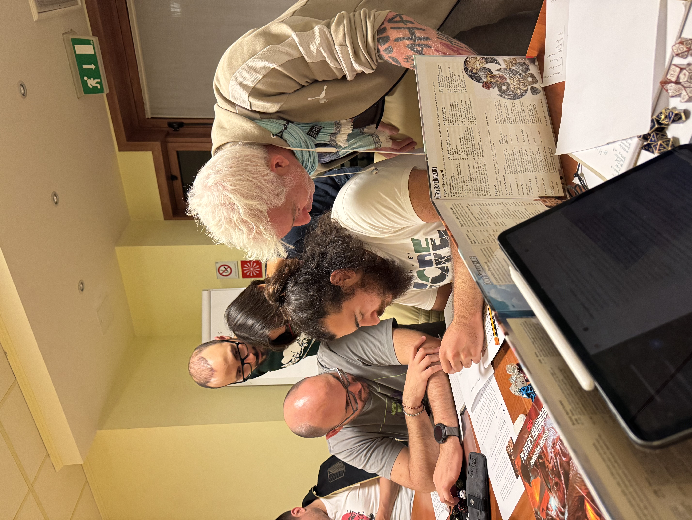
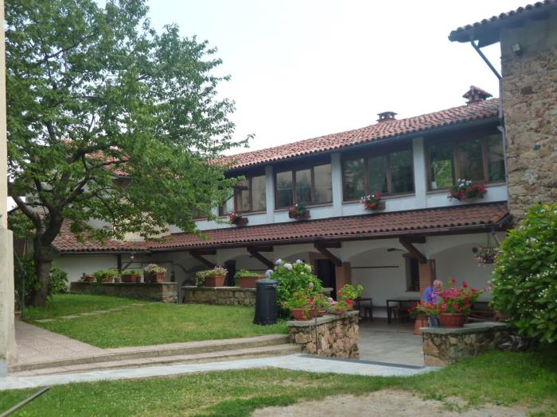

## 6 - 8 FEBBRAIO 2026 CURINO (BI)

## Io e il gruppo

<figure>
      
</figure>

## TEMATICA

Spesso come adulti ci troviamo a lavorare, vivere, crescere all'interno di gruppi di persone. In queste situazioni diventa fondamentale sapersi ascoltare e osservare, ma anche riuscire a comprendere le dinamiche di gruppo che si attivano, per capire come muoversi in modo efficiente e sereno in ogni contesto. Durante queste giornate lavoreremo sulle dinamiche di gruppo e rifletteremo su ciò che caratterizza i gruppi: la figura del leader, la fiducia negli altri, ma al tempo stesso il giusto confine tra l'appartenenza e la riservatezza, tra l'Io e il Gruppo.

### Questo Turno di Guardia è in collaborazione con la cooperativa Vivaio Famiglia

## ATTIVITÀ

- Avventura di gioco di ruolo
- Cerchi di parola
- Giochi in scatola
- Giochi a squadre
- Canzoni
- Passeggiate nella natura

## LA CASA

<figure>
      
</figure>

La casa che ci ospiterà si trova nella frazione di San Nicolao, a Curino, in provincia di Biella. È una struttura con cui collaboriamo volentieri da tempo perché amiamo la loro ospitalità e perché il ricavato di ciò che viene dato loro per l'alloggio viene versato all'Organizzazione Mato Grosso. La casa si sviluppa su due piani e ha un ampio giardino all'esterno, completo di calcetto e ping pong. Il piano terra viene utilizzato per le attività principali e i pasti, sono presenti due bagni sotto al porticato. Il primo piano ospita invece la camera delle formatrici, una delle due camerate e altri bagni. Mentre la soffitta ospita l'ultima camerata disponibile. Durante il nostro soggiorno è possibile che familiari e amici della signora Antonia, che ci ospita e si prende cura di noi, arrivino alla casa, ma sempre lasciandoci spazio e riservatezza per effettuare le nostre attività nei luoghi prestabiliti.

## Programma sommativo delle giornate





- Accoglienza alle 10:00
- Sistemazione nelle camerate e giochi di presentazione
- Primo Cerchio per la condivisione degli Accordi e dei Turni di servizio
- Sessione di costruzione dei personaggi per il gioco di ruolo
- Sessione di gioco di ruolo
- Giochi a squadre
- Cerchio di parola




- Dinamiche rompighiaccio e Cerchio mattutino
- Passeggiata in natura e attività sul tema
- Sessione di gioco di ruolo
- Serata di festa
- Cerchio serale




- Dinamiche rompighiaccio e Cerchio mattutino
- Sessione di gioco di ruolo
- Sistemazione della casa e bagagli
- Debriefing sull’avventura e la tematica
- Momento di saluti
- Partenza alle 17:30




## PREZZO

La quota comprensiva di vitto, alloggio, attività ludico-formative e assicurazione è di 290,00 euro iva inclusa.

## ISCRIZIONI

**ATTENZIONE: Questo Turno è riservato a persone dai 25 anni in su, se ti trovi in un'altra fascia d'età controlla gli altri Turni presenti sul sito!**


<form action="https://docs.google.com/forms/u/0/d/e/1FAIpQLSfEAG-5YZemxqqRpYKKuFEpiSUC0ABFj-rdU97YcbRoyxbaDg/formResponse" method="post" target="hidden_iframe" onsubmit="submitted=true">
  <label>Nome e cognome del partecipante*</label>
        <input type="text" placeholder="Mario Rossi" class="form-input" name="entry.1765439111" required>

   <label>Età del partecipante*</label>
        <input type="text" placeholder="22" class="form-input" name="entry.1623645537" required>

  <label>Email partecipante*</label>
        <input type="email" placeholder="mariorossi@gmail.com" class="form-input" name="entry.72042641" required>

  <label>Numero di telefono del partecipante*</label>
        <input type="text" placeholder="3335550081" class="form-input" name="entry.721369235" required>

   <button type="submit">Invia</button>
</form>

