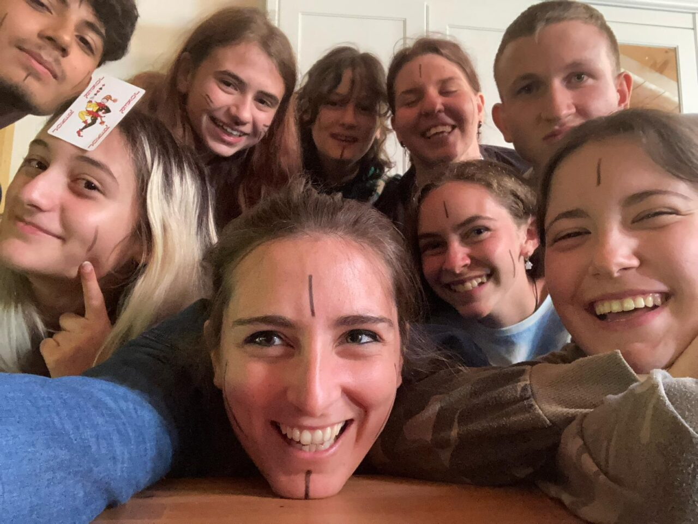
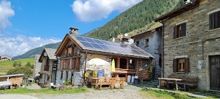

## 30 Aprile - 3 Maggio 2026 Tartano (SO)

## Indipendenza

<figure>
      
</figure>

## TEMATICA

Per questa fascia d'età abbiamo deciso di concentrarci sulla tematica dell'indipendenza intesa come crescita, come distacco dalle figure genitoriali e dal passato, come scelta e integrazione di ciò che fa parte della nostra identità per andare oltre e percorrere la propria strada. Attraverso un’avventura scritta appositamente su questo tema e momenti di condivisione, il gruppo avrà diversi spunti su cui riflettere.

## ATTIVITÀ

- Avventura di gioco di ruolo
- Cerchi di parola
- Giochi in scatola
- Giochi a squadre
- Canzoni
- Passeggiate nella natura

## IL RIFUGIO

<figure>
      
</figure>

Il rifugio che ci ospiterà si trova nel borgo di Arale, in Val Tartano (SO) ed è una struttura che si sviluppa su due diversi edifici. Una casa ospita la camerata su due piani, completa di bagni e docce separate. L’altro edificio ospita la sala in cui si svolgono i pasti e le attività al tavolo, mentre al piano di sotto troviamo un altro spazio per le attività al chiuso e un bagno completo di doccia.  Lo spazio all’aperto è molto ampio e non ha un confine con le montagne e i boschi circostanti, il che ci permetterà – clima permettendo – di effettuare una breve escursione nei dintorni.
Il rifugio è gestito dal Pirata Vittorio e da Leila, che si occupano della preparazione dei pasti.

## TESTIMONIANZE DI ALTRI TURNI

 Questo sarà il primo Turno dedicato a questa fascia d'età, ma ecco alcune testimonianze della fascia degli Adolescenti:



## Programma sommativo delle giornate





- Accoglienza alle 14:00
- Sistemazione nelle camerate e giochi di presentazione
- Sessione di costruzione dei personaggi per il gioco di ruolo
- Sessione di gioco di ruolo
- Cerchio di parola




- Dinamiche rompighiaccio e Cerchio mattutino
- Attivazioni sulla tematica
- Sessione di gioco di ruolo
- Giochi a squadre
- Cerchio serale




- Dinamiche rompighiaccio e Cerchio mattutino
- Passeggiata in natura e attivazione sulla tematica
- Sessione di gioco di ruolo
- Serata di festa (giochi vari, balli, karaoke, attività proposte dal gruppo)
- Cerchio serale




- Dinamiche rompighiaccio e Cerchio mattutino
- Debriefing sull’avventura e la tematica
- Sistemazione della casa e bagagli
- Momento di saluti
- Partenza alle 16:00




## PREZZO

La quota comprensiva di vitto, alloggio, attività ludico-formative, breve escursione con guida alpina e assicurazione è di 360,00 euro iva inclusa.
Coloro che si iscrivono al loro primo Turno di Guardia possono usufruire dello sconto del 5% per la promozione "Nuovi Avventurieri".

## PRE-ISCRIZIONE

Se siete interessati a iscrivervi a questo Turno di Guardia potete compilare
il seguente form. Vi arriverà una mail con le indicazioni per confermare la prenotazione.

### Ricordiamo che questo Turno è riservato a giovani dai 19 ai 25 anni


<form action="https://docs.google.com/forms/d/e/1FAIpQLSeDWm8uJErrrqdCo_Bblex5aIJx_n8rMFTFBSZfUVribjRrKw/formResponse" method="post" target="hidden_iframe" onsubmit="submitted=true">
  <label>Nome e cognome del partecipante*</label>
        <input type="text" placeholder="Mario Rossi" class="form-input" name="entry.1765439111" required>

   <label>Età del partecipante*</label>
        <input type="text" placeholder="22" class="form-input" name="entry.1623645537" required>

  <label>Email partecipante*</label>
        <input type="email" placeholder="mariorossi@gmail.com" class="form-input" name="entry.72042641" required>

  <label>Numero di telefono del partecipante*</label>
        <input type="text" placeholder="3335550081" class="form-input" name="entry.721369235" required>

   <button type="submit">Invia</button>
</form>

